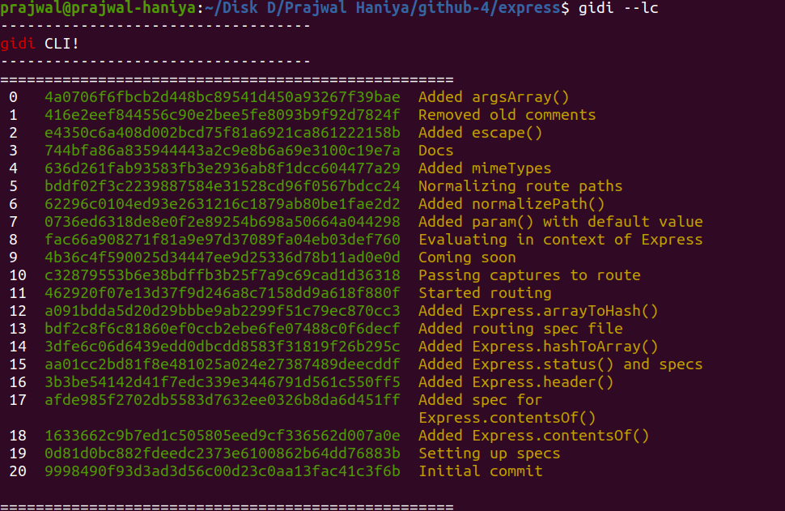
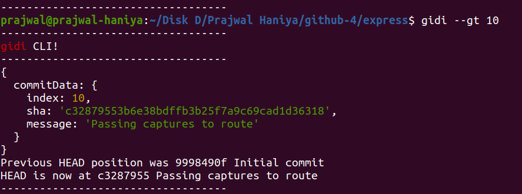

# git-discover

A CLI tool that will help you go back in time for a repository on github.

`gidi` is the cli command which will help you fetch commits, and switch to a particular commit.

## Installation

`npm i git-discover`

## config gidi cli

At first you need to config the cli to fetch the commits. By default the configuration is set for express library (As I built this tool to go through this repo).

`gidi --config OWNER REPO REF`

eg: `gidi --config 'expressjs' 'express' 'head/master' `

## Get commits 

`gidi --gc SINCE UNTIL`

eg: `gidi --gc '2009-06-26' '2009-06-30'`

## List commits

`gidi --lc`

## Go back in time (Set project to a particular commit)

`gidi --gt INDEX`

